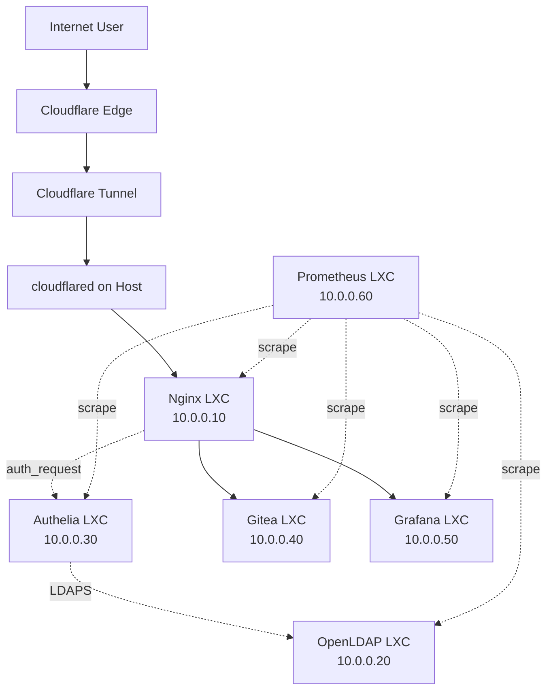

# Proxmox Homelab

> A lightweight, security-focused homelab running on a Lenovo Y520 laptop with 16 GB RAM, demonstrating production-grade infrastructure patterns on constrained hardware.

## Overview

This project showcases how to build a complete infrastructure platform including centralized identity, SSO, reverse proxying, Git hosting, monitoring, and security hardening — all running in LXC containers on a single laptop behind CG-NAT.

## Architecture



## Tech Stack

| Layer | Technology |
|-------|------------|
| **Hypervisor** | Proxmox VE 9.x |
| **Containers** | LXC (Debian 12 Bookworm) |
| **Reverse Proxy** | Nginx |
| **Identity** | OpenLDAP |
| **SSO/OIDC** | Authelia |
| **Git** | Gitea (SQLite) |
| **Monitoring** | Prometheus + Grafana |
| **Tunnel** | Cloudflare Tunnel |
| **Automation** | Ansible |
| **Secrets** | SOPS + age |
| **Documentation** | MkDocs + GitHub Pages |

## Services

| Service | URL | Purpose |
|---------|-----|---------|
| Gitea | https://git.example.com | Git hosting, GitHub mirror |
| Grafana | https://grafana.example.com | Dashboards, visualization |
| Authelia | https://auth.example.com | SSO portal, MFA |
| Prometheus | Internal only | Metrics collection |

## Hardware

- **CPU**: Intel i7-7700HQ (4C/8T)
- **RAM**: 16 GB DDR4
- **Storage**: 128 GB M.2 SSD (ext4) + planned 2.5" SATA
- **Network**: Gigabit Ethernet (vmbr0 bridge)
- **ISP**: CG-NAT (Cloudflare Tunnel)

## Security Highlights

- **Zero public ports** — Cloudflare Tunnel only
- **SSH key-only** — No password auth, fail2ban
- **Centralized SSO** — Authelia OIDC + TOTP MFA
- **LDAPS only** — Encrypted LDAP communication
- **Defense in depth** — Cloudflare WAF → Nginx → Authelia → LDAP
- **Secrets encrypted** — SOPS + age in Git

## Repository Structure

```
proxmox-homelab/
├── docs/                 # MkDocs documentation
│   ├── 01-architecture/  # Architecture & hardware
│   ├── 02-proxmox/       # Proxmox installation & config
│   ├── 03-networking/    # Network, tunnel, firewall
│   ├── 04-identity/      # LDAP, Authelia, OIDC
│   ├── 05-services/      # Nginx, Gitea, Grafana, Prometheus
│   ├── 06-security/      # Hardening, firewall, checklists
│   ├── 07-monitoring/    # Prometheus, dashboards
│   ├── 08-automation/    # Ansible
│   └── 09-backups/       # Backup strategy
├── diagrams/             # Mermaid diagrams
├── ansible/              # Infrastructure as Code
├── configs/              # Example configurations
├── scripts/              # Operational scripts
└── mkdocs.yml            # Documentation config
```

## Documentation

**Live at**: https://dmaljkovic.github.io/proxmox-homelab/

Built with MkDocs Material, deployed via GitHub Pages.

## Getting Started

See [Proxmox Installation](docs/02-proxmox/installation.md) for initial setup.

## Phases

| Phase | Description |
|-------|-------------|
| 0 | Proxmox VE install + hardening |
| 0.5 | Cloudflare Tunnel setup |
| 1 | LXC container creation |
| 2 | Nginx reverse proxy |
| 3 | OpenLDAP identity store |
| 4 | Authelia SSO/OIDC |
| 5 | Gitea + GitHub mirror |
| 6 | Prometheus monitoring |
| 7 | Grafana dashboards |
| 8 | Security LXC + auditing |
| 9 | Ansible automation |
| 10 | Backup & disaster recovery |
| 11 | Documentation polish |

## License

MIT License — see [LICENSE](LICENSE)

## Author

**Maljkovic** — [GitHub](https://github.com/dmaljkovic)
