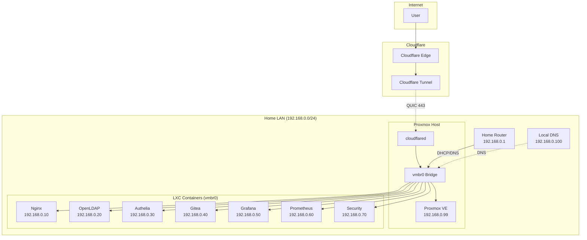

# Network Design

## Network Topology



## IP Address Plan

| Device | IP | MAC | Notes |
|--------|-----|-----|-------|
| Home Router | 192.168.0.1 | - | Gateway, DHCP server |
| Local DNS (Pi-hole) | 192.168.0.100 | - | Internal DNS |
| Proxmox Host | 192.168.0.99 | `aa:bb:cc:dd:ee:ff` | Static / DHCP reservation |
| Nginx (LXC 101) | 192.168.0.10 | `aa:bb:cc:dd:ee:01` | Static |
| OpenLDAP (LXC 102) | 192.168.0.20 | `aa:bb:cc:dd:ee:02` | Static |
| Authelia (LXC 103) | 192.168.0.30 | `aa:bb:cc:dd:ee:03` | Static |
| Gitea (LXC 104) | 192.168.0.40 | `aa:bb:cc:dd:ee:04` | Static |
| Grafana (LXC 105) | 192.168.0.50 | `aa:bb:cc:dd:ee:05` | Static |
| Prometheus (LXC 106) | 192.168.0.60 | `aa:bb:cc:dd:ee:06` | Static |
| Security (LXC 107) | 192.168.0.70 | `aa:bb:cc:dd:ee:07` | Static |

## Proxmox Network Config (`/etc/network/interfaces`)

```bash
auto lo
iface lo inet loopback

auto eno1
iface eno1 inet manual

auto vmbr0
iface vmbr0 inet static
    address 192.168.0.99/24
    gateway 192.168.0.1
    bridge-ports eno1
    bridge-stp off
    bridge-fd 0
    # DNS via local Pi-hole
    dns-nameservers 192.168.0.100 1.1.1.1
    dns-search unseen-uni.xyz
```

## LXC Network Config (each container)

```bash
# /etc/pve/lxc/101.conf (example)
net0: name=eth0,bridge=vmbr0,ip=192.168.0.10/24,gw=192.168.0.1,hwaddr=aa:bb:cc:dd:ee:01
```

## Cloudflare Tunnel Network Flow

```
1. User → git.unseen-uni.xyz (DNS → Cloudflare IPs)
2. Cloudflare Edge (Anycast) → TLS termination, WAF
3. Cloudflare Tunnel (QUIC/443) → Encrypted to cloudflared
4. cloudflared (on Proxmox host, outbound only)
5. cloudflared → Local HTTP (192.168.0.10:80)
6. Nginx → Application
```

## Firewall Rules (UFW on Proxmox Host)

```bash
# Default policies
ufw default deny incoming
ufw default allow outgoing

# LAN management
ufw allow from 192.168.0.0/24 to any port 22 proto tcp    # SSH
ufw allow from 192.168.0.0/24 to any port 8006 proto tcp  # Proxmox GUI

# Cloudflare Tunnel (outbound only)
ufw allow out 443 proto tcp  # cloudflared to Cloudflare

# NO inbound 80/443 - tunnel handles all external traffic
```

## Internal LXC Firewall (Conceptual)

| Source | Destination | Port | Purpose |
|--------|-------------|------|---------|
| Nginx (101) | Gitea (104) | 3000 | Reverse proxy |
| Nginx (101) | Grafana (105) | 3000 | Reverse proxy |
| Nginx (101) | Authelia (103) | 9091 | auth_request |
| Authelia (103) | LDAP (102) | 636 | LDAPS bind |
| Gitea (104) | Authelia (103) | 443 | OIDC discovery |
| Grafana (105) | Authelia (103) | 443 | OIDC discovery |
| Prometheus (106) | All | 9090,9100,etc | Metrics scrape |
| Security (107) | All | Various | Testing/audit |

## DNS Records (Cloudflare)

| Name | Type | Target | Proxy |
|------|------|--------|-------|
| proxmox | A | 192.168.0.99 | DNS Only (grey) |
| git | CNAME | `<tunnel-id>.cfargotunnel.com` | Proxied (orange) |
| grafana | CNAME | `<tunnel-id>.cfargotunnel.com` | Proxied (orange) |
| auth | CNAME | `<tunnel-id>.cfargotunnel.com` | Proxied (orange) |

## Why This Design?

- **Single bridge (vmbr0)**: Simple, all LXCs on same L2 segment
- **Static IPs**: Predictable, no DHCP dependency for services
- **Cloudflare Tunnel**: Works behind CG-NAT, no port forwarding
- **Local DNS**: Pi-hole for internal resolution, ad blocking
- **No VLANs (yet)**: KISS principle; VLANs are Phase 2
