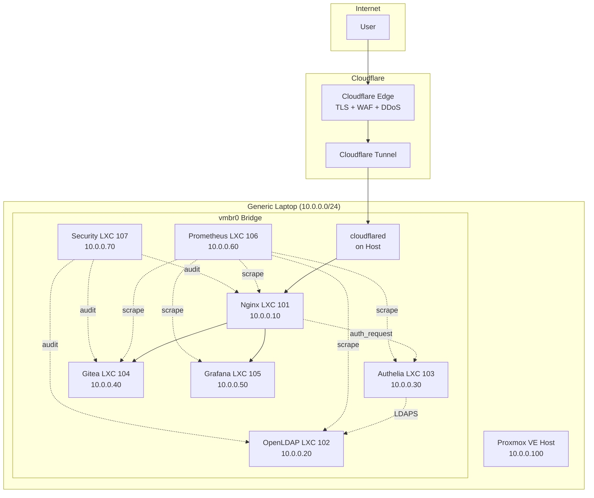

# Architecture Overview

## Design Philosophy

This homelab demonstrates how to build a production-grade infrastructure platform on constrained hardware (laptop) using:

- **LXC containers** instead of VMs (lower overhead)
- **Single entry point** via Nginx reverse proxy
- **Centralized identity** via OpenLDAP + Authelia OIDC
- **Zero public exposure** via Cloudflare Tunnel
- **Infrastructure as Code** via Ansible
- **Observability** via Prometheus + Grafana

## High-Level Architecture



## Component Responsibilities

| Component | Role | Port(s) |
|-----------|------|---------|
| cloudflared | Encrypted tunnel to Cloudflare | 443 (outbound) |
| Nginx | TLS termination, routing, auth_request | 80 (internal) |
| OpenLDAP | Identity store (users/groups) | 636 (LDAPS) |
| Authelia | SSO, MFA, OIDC provider | 9091 (internal) |
| Gitea | Git server, GitHub mirror | 3000 (internal) |
| Grafana | Dashboards, visualization | 3000 (internal) |
| Prometheus | Metrics collection | 9090 (internal) |
| Security | Audit/testing tools | Various |

## Data Flow

### Web Request (git.example.com)

```
1. User → https://git.example.com
2. Cloudflare Edge (TLS, WAF)
3. Cloudflare Tunnel (QUIC, encrypted)
4. cloudflared (on Proxmox host)
5. Nginx (10.0.0.10:80)
6. auth_request → Authelia (10.0.0.30:9091)
7. Authelia validates session / redirects to login
8. Authelia → OpenLDAP (10.0.0.20:636) for credentials
9. Authelia returns 200 + headers (user, groups)
10. Nginx → proxy_pass → Gitea (10.0.0.40:3000)
11. Gitea receives authenticated request
```

### Metrics Collection

```
Prometheus (10.0.0.60:9090) scrapes:
- Nginx: 10.0.0.10:9113 (nginx-prometheus-exporter)
- Gitea: 10.0.0.40:3000/metrics
- Grafana: 10.0.0.50:3000/metrics
- Authelia: 10.0.0.30:9091/metrics
- OpenLDAP: 10.0.0.20:9187 (ldap-exporter)
- Node Exporter: 10.0.0.100:9100 (on Proxmox host)
- All LXCs: 10.0.0.x:9100 (node_exporter in each)
```

## Resource Allocation

| LXC ID | Service | RAM | CPU | Disk |
|--------|---------|-----|-----|------|
| 101 | Nginx | 256 MB | 1 | 4 GB |
| 102 | OpenLDAP | 256 MB | 1 | 4 GB |
| 103 | Authelia | 256 MB | 1 | 4 GB |
| 104 | Gitea | 768 MB | 2 | 8 GB |
| 105 | Grafana | 512 MB | 1 | 8 GB |
| 106 | Prometheus | 512 MB | 1 | 8 GB |
| 107 | Security | 512 MB | 1 | 4 GB |
| **Total** | | **~3.5 GB** | | **~40 GB** |

Host reserves ~2 GB, leaving ~10 GB for cache/bursts.

## Security Model

```
Internet
    │
    ▼
Cloudflare (TLS, WAF, DDoS)
    │
    ▼
Encrypted Tunnel (outbound only)
    │
    ▼
Nginx (only service reachable via tunnel)
    │
    ├── auth_request → Authelia
    │       │
    │       └── LDAPS → OpenLDAP
    │
    ├── proxy_pass → Gitea
    │
    └── proxy_pass → Grafana

All other services: NO direct external access
```

## Why This Design?

| Decision | Rationale |
|----------|-----------|
| LXC not VMs | 10x less RAM overhead, faster boot |
| No ZFS | 128 GB single SSD, ZFS needs RAM |
| Cloudflare Tunnel | CG-NAT, no port forwarding, free TLS |
| Authelia not Keycloak | ~30 MB RAM vs 500+ MB, simpler |
| SQLite for Gitea/Grafana | Single-user, no external DB needed |
| Prometheus not full stack | 15-day retention, lightweight |
| Ansible | Reproducible, version-controlled infra |
