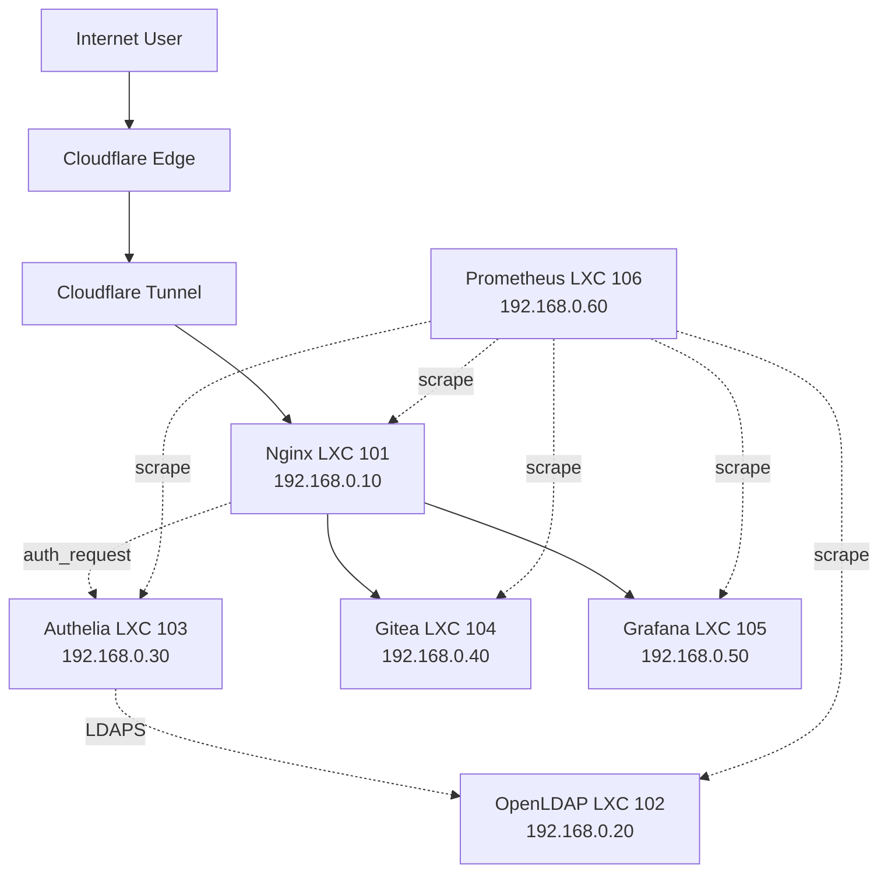

# Proxmox Homelab

A lightweight, security-focused homelab running on a Lenovo Y520 laptop with 16 GB RAM.

## Quick Links

- [Architecture Overview](01-architecture/overview.md)
- [Hardware Specs](01-architecture/hardware.md)
- [Network Design](01-architecture/network.md)
- [Proxmox Installation](02-proxmox/installation.md)
- [Cloudflare Tunnel](03-networking/cloudflare-tunnel.md)
- [OpenLDAP](04-identity/openldap.md)
- [Authelia SSO](04-identity/authelia.md)
- [Gitea](05-services/gitea.md)
- [Grafana](05-services/grafana.md)
- [Prometheus](05-services/prometheus.md)

## Tech Stack

| Layer | Technology |
|-------|------------|
| Hypervisor | Proxmox VE 9.x |
| Containers | LXC (Debian 12) |
| Reverse Proxy | Nginx |
| Identity | OpenLDAP |
| SSO/OIDC | Authelia |
| Git | Gitea (SQLite) |
| Monitoring | Prometheus + Grafana |
| Tunnel | Cloudflare Tunnel |
| Automation | Ansible |
| Secrets | SOPS + age |
| Documentation | MkDocs + GitHub Pages |

## Network Topology



## Repository Structure

```
proxmox-homelab/
├── docs/                 # MkDocs documentation
├── diagrams/             # Mermaid diagrams
├── ansible/              # Infrastructure as Code
├── configs/              # Example configurations
├── scripts/              # Operational scripts
└── mkdocs.yml            # Documentation config
```

## Getting Started

See [Proxmox Installation](02-proxmox/installation.md) for initial setup.

## Security

- No public ports exposed (CG-NAT + Cloudflare Tunnel)
- SSH key-only authentication
- All web traffic via Nginx + Authelia SSO
- Internal services isolated on vmbr0
- Secrets encrypted with SOPS/age
